# Awesome-Cloud-Web-Management-Console 🖥️ 🌐

  

      

---

## 🌟 Top Cloud Web Management Console Ecosystem

**Curated List of Commercial Cloud Consoles & Open-Source Infrastructure Dashboards**  
*Focused on Browser-Based Cloud Management, Multi-Cloud Dashboards, Self-Hosted Control Panels, Resource Provisioning UIs & Infrastructure Visualization*

**Last updated: October 2026** 📅

---

### 📌 Overview & SEO Summary

Welcome to the ultimate curated directory of **cloud web management consoles**, **open-source infrastructure dashboards**, and **self-hosted control panels**. Whether you are looking for enterprise-grade commercial solutions (such as *AWS Management Console*, *Google Cloud Console*, and *Microsoft Azure Portal*), or self-hostable open-source alternatives (like *Coolify*, *Portainer*, *Rancher*, and *Cockpit*), this list covers category leaders, multi-cloud dashboards, and privacy-respecting control planes.

**Key Market Context & Insights:**
- **Market Size & Growth:** The Global Cloud Management Platform (CMP) and Infrastructure Dashboard market is estimated at **$18.4 Billion in 2025** and is projected to reach over **$42 Billion by 2030** (CAGR ~17.8%).
- **Market Structure & Fragmentation:** The SaaS public cloud sector is **highly concentrated** (winner-take-all dynamics dominated by the Big 3 Hyperscalers: Microsoft, Amazon, and Google, who control >65% of global cloud infrastructure). Conversely, the self-hosted and open-source control panel market is **moderately fragmented**, with specialized dashboards catering to Kubernetes, Docker container management, and PaaS hosting.

---

## 📑 Table of Contents

- [🏢 SaaS / Commercial Platforms](#-saas--commercial-platforms)
- [🔓 Open-Source GitHub Projects](#-open-source-github-projects)
- [🛠️ How to Contribute](#%EF%B8%8F-how-to-contribute)
- [📊 Star History](#-star-history)
- [🤝 Support & Sponsorship](#-support--sponsorship)
- [⚠️ Disclaimer](#%EF%B8%8F-disclaimer)

---

## 🏢 SaaS / Commercial Platforms

*Market Size: Estimated $18.4B Global Cloud Management Platform Sector. The market exhibits high concentration at the top (hyperscaler oligopoly), alongside a vibrant long-tail of specialized cloud providers.*

| SaaS / Commercial Platform | Company / Owner | Market Cap / Valuation | Standard Edition Starting Price | Free Tier / Free Trial Limits | Description |
| :--- | :--- | :--- | :--- | :--- | :--- |
| **[Microsoft Azure Portal](https://portal.azure.com/)** 🔷 | Microsoft | **~$3.90 Trillion** | **$0.00/mo** (pay-as-you-go for provisioned infrastructure) | **12 Months Free** ($200 credit for 30 days + 55+ popular services always free) | **Azure-native web console** — **200+ services** with **customizable dashboards**, **Azure Cloud Shell** integration, resource group governance, and enterprise FinOps. ⚡ |
| **[AWS Management Console](https://aws.amazon.com/console/)** ☁️ | Amazon | **~$2.00 Trillion** | **$0.00/mo** (pay-as-you-go for provisioned resources) | **12 Months Free Tier** (includes 750 hrs/mo EC2 micro, 5GB S3 storage, 1M AWS Lambda requests/mo free forever) | **AWS-native web console** — **500+ service interfaces** with **unified search**, integrated **AWS CloudShell**, **Tag Editor**, and **Cost Explorer** FinOps suite. 🚀 |
| **[Google Cloud Console](https://console.cloud.google.com/)** 🌐 | Google (Alphabet) | **~$2.00 Trillion** | **$0.00/mo** (pay-as-you-go for provisioned resources) | **$300 Free Credit** (90-day trial + 20+ Always Free products including e2-micro instance & Cloud Run) | **GCP-native web console** — **150+ services** with **Cloud Shell** built-in, **Cloud Monitoring** dashboards, IAM access policies, and project resource hierarchies. 📊 |
| **[Oracle Cloud Infrastructure Console](https://cloud.oracle.com/)** 🔴 | Oracle | **~$300 Billion** | **$0.00/mo** (pay-as-you-go for compute/storage) | **Always Free Tier** (4 OCPU ARM Ampere compute + 24 GB RAM + 200 GB storage free forever + $300 trial credit) | **Oracle-native web console** — High-performance compute & database console featuring the **most generous free tier in the cloud industry**. ⚡ |
| **[IBM Cloud Console](https://cloud.ibm.com/)** 🔵 | IBM | **~$200 Billion** | **$0.00/mo** (pay-as-you-go tier) | **Lite Account (Free Forever)** (Access to 40+ IBM Cloud Lite services including Watson AI APIs & Kubernetes cluster) | **IBM-native console** — **200+ enterprise services** tailored for hybrid cloud, IBM Watson AI workloads, quantum computing, and regulated enterprise compliance. 🏢 |
| **[Linode Cloud Manager](https://cloud.linode.com/)** 🔵 | Akamai | **~$15 Billion** | **$5.00/mo** (Standard 1GB Nanode instance) | **$100 Free Credit** (valid for 60 days upon new signup) | **Akamai-integrated cloud console** — Clean, developer-centric interface for managing Linodes, Kubernetes clusters, NodeBalancers, and Object Storage. 🌐 |
| **[Scaleway Elements Console](https://console.scaleway.com/)** 🇫🇷 | Scaleway (Iliad Group) | **~$10 Billion** | **€2.19/mo** (Stardust cloud instance) | **Free Tier Limits** (75 GB Object Storage & 75 GB Coldstorage free forever per month) | **European cloud console** — GDPR-compliant sovereign web interface for cloud instances, managed Kubernetes, bare metal, and serverless compute. 🇪🇺 |
| **[DigitalOcean Cloud Console](https://cloud.digitalocean.com/)** 🌊 | DigitalOcean | **~$3.00 Billion** | **$4.00/mo** (Basic Droplet) | **$200 Free Credit** (valid for 60 days for new accounts) | **Developer-favorite cloud UI** — Ultra-intuitive management panel for Droplets, managed Kubernetes, App Platform PaaS, and Managed Databases. 🐳 |
| **[Vultr Portal](https://my.vultr.com/)** 🟣 | Vultr | **~$1.50 Billion** (Private) | **$2.50/mo** (IPv6-only Compute instance) | **$250 Free Credit** (30-day promotional trial for new signups) | **High-performance cloud portal** — Web interface for provisioning instances, bare metal servers, block storage, and Kubernetes across 32 global regions. ⚡ |
| **[Hetzner Cloud Console](https://console.hetzner.cloud/)** 🇩🇪 | Hetzner Online | **~$1.00 Billion** (Private) | **€3.79/mo** (CX22 cloud instance) | **€20 Free Credit** (new user promotional code valid for 14 days) | **Efficient German cloud dashboard** — Fast, minimal web console for cloud servers, floating IPs, private networks, and block storage at industry-leading price-performance. 🇩🇪 |

---

## 🔓 Open-Source GitHub Projects

*Sorted by GitHub Stars Count (Descending)* 🌟

- **[Coolify](https://github.com/coollabsio/coolify)**   
  **An open-source & self-hostable Heroku / Netlify / Vercel alternative**, Apache-2.0 licensed. **62,683+ GitHub stars** — The fastest-growing self-hosted PaaS web management console. Manage applications, databases, and services with automatic Let's Encrypt SSL and Git push-to-deploy workflows. 🚀

- **[Portainer](https://github.com/portainer/portainer)**   
  **Container management for Docker and Kubernetes**, zlib licensed. **38,621+ GitHub stars** — The definitive web UI for managing containers, images, volumes, networks, and Helm stacks across multi-cluster environments. 🐳

- **[Nginx Proxy Manager](https://github.com/NginxProxyManager/nginx-proxy-manager)**   
  **Docker container for managing Nginx proxy hosts with a web UI**, MIT licensed. **34,334+ GitHub stars** — Expose internal cloud services easily and securely with automated Let's Encrypt SSL certificates, access lists, and custom location routing via an intuitive web dashboard. 🌐

- **[Dokku](https://github.com/dokku/dokku)**   
  **Docker powered mini-Heroku in CLI & Web UI ecosystem**, MIT licensed. **32,171+ GitHub stars** — The smallest PaaS implementation you will ever see. Docker-powered platform for deploying and managing applications on your own servers via Git push. ⚓

- **[Rancher](https://github.com/rancher/rancher)**   
  **Complete Kubernetes management platform**, Apache-2.0 licensed. **25,961+ GitHub stars** — Enterprise-grade multi-cluster Kubernetes management console with built-in security, monitoring, logging, and application catalog. ☸️

- **[Kubernetes Dashboard](https://github.com/kubernetes/dashboard)**   
  **General purpose web-based UI for Kubernetes clusters**, Apache-2.0 licensed. **15,408+ GitHub stars** — Official general-purpose web-based UI for Kubernetes clusters. Inspect workloads, troubleshoot pod failures, and manage containerized applications directly in the browser. ☸️

- **[Cockpit](https://github.com/cockpit-project/cockpit)**   
  **Web-based graphical interface for Linux servers**, LGPL-2.1 licensed. **15,185+ GitHub stars** — Lightweight browser-based server control panel used by RHEL, Fedora, Debian, and Ubuntu. Includes browser terminal, systemd management, network configuration, and disk storage monitoring. 🐧

- **[CapRover](https://github.com/caprover/caprover)**   
  **Automated App Deployer & Build Server**, Apache-2.0 licensed. **15,180+ GitHub stars** — Extremely easy-to-use PaaS web dashboard for NodeJS, Python, PHP, Ruby, MySQL, MongoDB, and Postgres apps with 1-click template deployments. 🚀

- **[Headlamp (CNCF)](https://github.com/headlamp-k8s/headlamp)**   
  **Kubernetes UI with plugin architecture**, Apache-2.0 licensed. **7,393+ GitHub stars** — CNCF Sandbox project providing a modern multi-cluster Kubernetes console with extensible React plugins and real-time resource visualization. 🪔

- **[Apache CloudStack UI](https://github.com/apache/cloudstack)**   
  **CloudStack web console**, Apache-2.0 licensed. **3,089+ GitHub stars** — Turnkey IaaS platform web portal for public and private cloud orchestration, compute provisioning, and self-service multi-tenancy. ☁️

- **[aaPanel](https://github.com/aaPanel/aaPanel)**   
  **Simple but powerful Web Hosting Control Panel**, GPL-3.0 licensed. **3,065+ GitHub stars** — Web-based server management control panel to manage LNMP/LAMP web stacks, databases, FTP, files, and cron jobs with 1-click installation scripts. 🎛️

- **[OpenNebula Sunstone](https://github.com/OpenNebula/one)**   
  **OpenNebula web console**, Apache-2.0 licensed. **1,750+ GitHub stars** — Lightweight cloud management console for private, hybrid, and edge clouds with virtual machine management and enterprise federation. 🌐

- **[OpenStack Horizon](https://github.com/openstack/horizon)**   
  **OpenStack dashboard**, Apache-2.0 licensed. **1,406+ GitHub stars** — Canonical web interface for OpenStack cloud infrastructure. Provision compute instances, block storage, networks, and keypairs. 🏗️

- **[Xen Orchestra](https://github.com/vatesfr/xen-orchestra)**   
  **Web management console for XenServer and XCP-ng**, AGPL-3.0 licensed. **992+ GitHub stars** — Complete web interface for XCP-ng and XenServer hypervisors, featuring live VM migration, automated backups, and metric graphs. 🛡️

- **[Cockpit Podman](https://github.com/cockpit-project/cockpit-podman)**   
  **Podman container management plugin for Cockpit**, LGPL-2.1 licensed. **643+ GitHub stars** — Web interface extension for Cockpit to manage daemonless Podman containers, images, and pods. 🎛️

- **[oVirt WebAdmin](https://github.com/oVirt/ovirt-engine)**   
  **oVirt web administration portal**, Apache-2.0 licensed. **611+ GitHub stars** — Feature-rich open-source virtualization management console providing enterprise KVM management and high availability. 🏢

- **[Proxmox VE Web UI](https://github.com/proxmox/pve-manager)**   
  **Proxmox VE web management interface**, AGPL-3.0 licensed. **101+ GitHub stars** — Official web console for the Proxmox VE hypervisor, integrating KVM virtualization, LXC containers, software-defined storage, and clustering. 🎯

---

## 🛠️ How to Contribute

Contributions are welcome! Follow these steps to submit new cloud console platforms or open-source management dashboards:

1. 🍴 **Fork** the repository.
2. 📝 **Add/edit** entries in `README.md` maintaining table/list structure and formatting.
3. 🔗 Include project title, official website/GitHub link, exact Stars Count, license, and brief description.
4. 🚀 Submit a **Pull Request** with a descriptive summary of your changes.

---

## 📊 Star History

---

## 🤝 Support & Sponsorship

If you find this cloud web management console directory useful, please consider supporting the project:

- ⭐ **Star** this repository to increase visibility!
- 🔀 **Fork** and share with fellow cloud architects, DevOps engineers, and open-source advocates.
- ☕ **Sponsor & Buy Me a Coffee**: Support ongoing open-source curation via the [GitHub Sponsor Dashboard](https://github.com/sponsors/ishandutta2007).

Thank you for supporting open-source software and curated developer ecosystems! 💖

---

## ⚠️ Disclaimer

- This is a **community-curated** list — not exhaustive and not an endorsement. ℹ️
- **All major cloud consoles are free to access** — you pay only for the underlying cloud resources provisioned. **AWS Management Console** provides **500+ service interfaces**, **Azure Portal** offers **200+ services** with customizable dashboards, and **GCP Console** provides **150+ services** with Cloud Shell.
- **Open-source consoles (Cockpit, Portainer, Rancher, Coolify) require infrastructure deployment** — they require self-hosting, SSL setup, and ongoing server maintenance. Always test console capabilities with a proof-of-concept before production deployment. 🖥️

---

  <b>Made with ❤️ for cloud architects, DevOps engineers, and open-source console advocates.</b>

